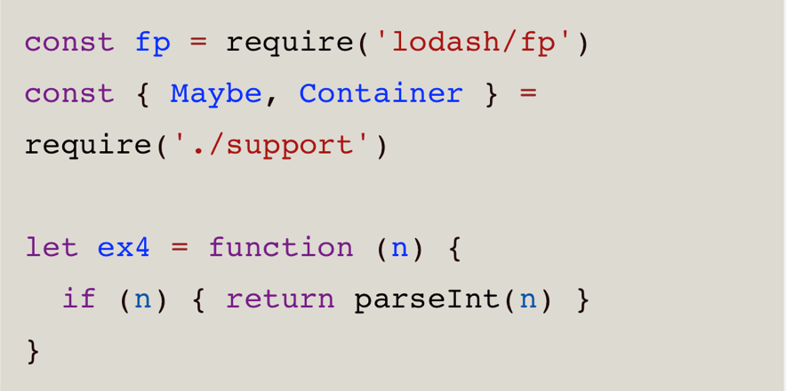

# 孙文龙 | Part1 | 模块二

## 简答题

### 1、引用计数的优缺点和工作原理
引用计数会内部通过引用计数器维护对象的引用数，对象引用关系发生变化时或改变引用数值，引用数值为零会立即回收对象。  
优点
- 当引用数为零时会立即回收垃圾对象
- 最大限度减少程序暂停，减少程序卡顿时间

缺点
- 引用计数无法清理循环引用的垃圾对象

### 2、标记整理算法的工作流程

标记整理将垃圾回收分成两个阶段，分别是标记阶段和整理阶段  
- 标记阶段，会遍历所有对象并标记活动对象（从根部可访问到的对象）
- 整理清除阶段，会先执行整理操作，移动活动对象位置为连续地址，接下来整体回收活动对象边界右侧的内存

### 3、V8 新生代存储区垃圾回收流程

新生代对象回收，新生代中用 Scavenge 算法来处理，通过标记整理和复制算法实现  
新生代内存会等分为两个空间，使用状态空间称为From，空闲空间称为To空间，From空间用于存储活动对象。  
当对象区域快被写满时，就需要执行一次垃圾清理操作。对From空间执行标记，之后会把存活对象复制到To空间，并有序排列起来  
接下来两个空间角色互换，直接释放掉原来的From空间  

### 4、增量标记算法使用场景和工作原理
v8引擎老生代中采用 标记清除、标记整理、增量标记算法，由于v8引擎会给老生代默认分配64位1.4G，32位700M的空间，当程序内存占用较大的情况下，如果单纯使用标记清除和整理算法，会使程序产生明显的卡顿，因为垃圾回收的操作会阻塞程序脚本的执行，这种卡顿也称位全停顿（stop-the-word）  
为了解决全停顿问题，v8采用增量标记算法  
v8增量标记原理就是将标记过程分为一个个的子标记过程，每个子过程与javascript脚本交替进行，直到一点点标记结束后，再一次性执行清除操作。
 
## 代码题1

### 1、使用fp.flowRight 重写下方函数


```
// code/1-1.js
const fp = require('lodash/fp');
const cars = require('./cars'); // 引入车辆数据

let isLastInStock = fp.flowRight(fp.prop('in_stock'), fp.last);

console.log(isLastInStock(cars))
```
### 2、使用fp.flowRight、fp.prop、fp.first获取第一个car的name
```
// code/1-2.js
const fp = require('lodash/fp');
const cars = require('./cars'); // 引入车辆数据

let getFirstName = fp.flowRight(fp.prop('name'), fp.first);

console.log(getFirstName(cars))
```

### 3、使用帮助函数_average重构averageDollarValue,使用函数组合方式

```
// code/1-3.js
const fp = require('lodash/fp');
const cars = require('./cars'); // 引入车辆数据

let dollarValues = fp.map(car => car.dollar_value);
let averageDollarValue = fp.flowRight(_average, dollarValues);

console.log(averageDollarValue(cars));
```

### 4、使用flowRight实现sanitizeNames函数，返回一个下划线链接的小写字符串，把数组中的name转换，ex: sanitizeNames(["Hellow World"]) => ["hello_world"]

```
// code/1-4.js
const fp = require('lodash/fp');
const cars = require('./cars'); // 引入车辆数据

let _underscore = fp.replace(/\s+/g, '_');
let sanitizeNames = fp.map(fp.flowRight(_underscore, fp.toLower));

console.log(sanitizeNames(["Hello World", "aLong 23"]))
```

## 代码题2

### 1、使用fp.add(x, y)和fp.map(f,x)创建一个可以让functor值增加的函数ex1

```
// code/2-1.js
const {Maybe, Container} = require('./support');
const fp = require('lodash/fp');

let maybe = Maybe.of([5, 6, 1]);
let ex1 = fp.map(fp.add(1));

console.log(maybe.map(ex1))
```

### 2、实现函数ex2,可以使用fp.first获取列表第一个元素

```
// code/2-2.js
const {Maybe, Container} = require('./support');
const fp = require('lodash/fp');

let maybe = Container.of(['do', 'ray', 'me', 'fa', 'so']);

let ex2 = fp.first;

console.log(maybe.map(ex2))
```

### 3、实现函数ex3,使用safeProp与fp.first找到user的名字首字母

```
// code/2-3.js
const {Maybe, Container} = require('./support');
const fp = require('lodash/fp');

let safeProp = fp.curry(function(x, o) {
    return Maybe.of(o[x])
})

let user = {id: 2, name: 'Albert'};

let ex3 = (o) => safeProp('name')(o).map(fp.first)

console.log(ex3(user))
```

### 4、使用Maybe重写ex4, 不要有if语句


```
// code/2-4.js
const {Maybe, Container} = require('./support');
const fp = require('lodash/fp');

let ex4 = (n) => {
    return Maybe.of(n).map(parseInt);
};

console.log(ex4('1'))
```
## 项目文件说明

- notes　······································ 笔记
    - README.md　······················ 笔记
- code ········································ 代码
    - supports.js ········ 代码题2提供的函子
    - cars.js ·············· 代码题1提供的数据
    - 1-1.js ······················ 代码题1练习1
    - 1-2.js ······················ 代码题1练习2
    - 1-3.js ······················ 代码题1练习3
    - 1-4.js ······················ 代码题1练习4
    - 2-1.js ······················ 代码题2练习1
    - 2-2.js ······················ 代码题2练习2
    - 2-3.js ······················ 代码题2练习3
    - 2-4.js ······················ 代码题2练习4
